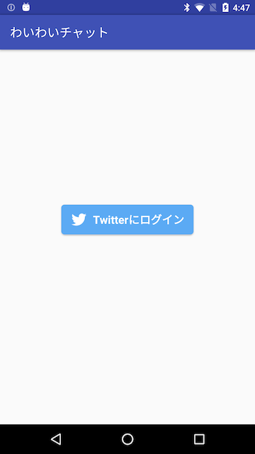
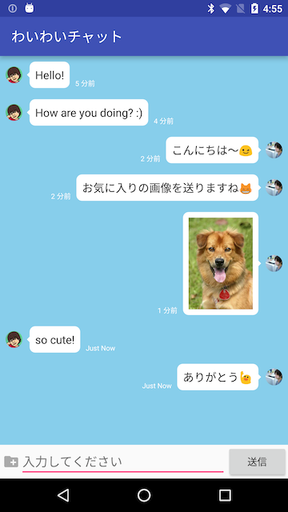
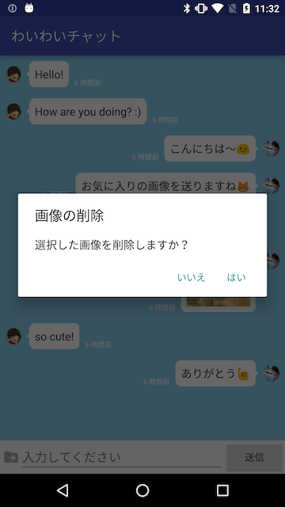

# FirebaseRealTimeChat

[わいわいチャット](https://play.google.com/store/apps/details?id=us.shiroyama.android.firebaserealtimechat)はFirebaseを使ったサンプルチャットアプリケーションです。





## Setup

このプロジェクトは[Retrolambda](https://github.com/orfjackal/retrolambda)を利用しています。そのため別途JDK8が必要です。

1. `google-services.json`を`./app`直下にコピー
1. `settings.properties`に必要事項を記入
1. `gradlew build`

## Libraries

このプロジェクトは以下のオープンソースソフトウェアを利用しています。

* Android Support Libraries
* [Firebase](https://firebase.google.com/terms/?hl=ja)
* [Dagger2](http://google.github.io/dagger/)
* [Butter Knife](https://github.com/JakeWharton/butterknife)
* [PermissionsDispatcher](https://github.com/hotchemi/PermissionsDispatcher)
* [Picasso](https://github.com/square/picasso)
* [ThreeTen Android Backport](https://github.com/JakeWharton/ThreeTenABP)
* [Lightweight-Stream-API](https://github.com/aNNiMON/Lightweight-Stream-API)
* [android-ago](https://github.com/curioustechizen/android-ago)
* [Material File Picker](https://github.com/nbsp-team/MaterialFilePicker)
* [Otto](https://github.com/square/otto)
* [Fabric SDK](https://get.fabric.io/)
* [Retrolambda](https://github.com/orfjackal/retrolambda)
* [realm](https://github.com/realm/realm-java/)

## License

このプロジェクトはApache 2.0ライセンスの範囲内で自由にご利用いただけます。

```
Copyright 2016 Fumihiko Shiroyama

Licensed under the Apache License, Version 2.0 (the "License");
you may not use this file except in compliance with the License.
You may obtain a copy of the License at

   http://www.apache.org/licenses/LICENSE-2.0

Unless required by applicable law or agreed to in writing, software
distributed under the License is distributed on an "AS IS" BASIS,
WITHOUT WARRANTIES OR CONDITIONS OF ANY KIND, either express or implied.
See the License for the specific language governing permissions and
limitations under the License.
```
